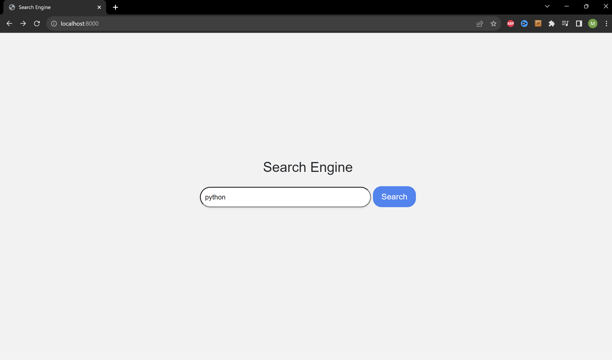
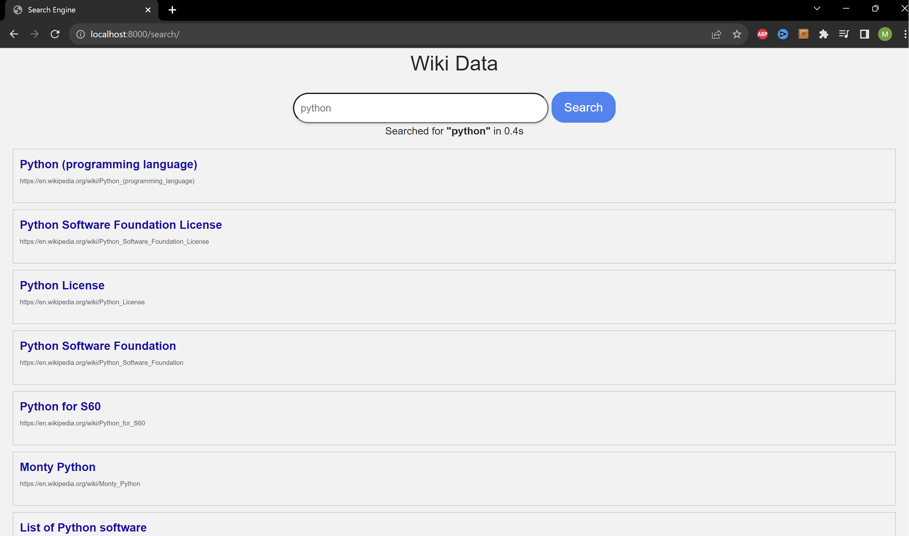

## Welcome to the Search Engine project.

It was mainly inspired by Larry Page's "The anatomy of a hypertextual search engine". And was created as a final project for Harvard's "Introduction to Web Development" online course.

To give a brief overview it was created by crawling wikipedia pages for the data set. Then a Index class was created to be able to quickly and efficiently compute relevant search data. Another key component is the search functionality. The UI aspect was created using the Django framework.

It contains a data set of around **5,500 wikipedia documents**.




### 1. We start at the beginning, collecting a data set of documents:

This was implemented by creating a venv to run the Scrapy framework, there was a crawling-spider that was created to search wikipedia articles collecting the article's name, url, content and links to other pages.

#### It was fed several seed url's to crawl including topics about:

- Programming languauges
- Biology, Chemistry
- Mathematics
- Physics
- Computer Hardware
- Animals.

It then recursively followed the seed page's links to crawl more wikipedia articles for a recursion depth of 1. The crawled data was then stored in the `wiki.json` file.

The spider implementation is found in the `wiki.py` file.

Paths are:

- `wiki.json`:

```
venv\wikipedia\wikipedia\spiders\wiki.py
```

- `wiki.py`:

```
venv\wikipedia\wikipedia\spiders\wiki.json
```

### 2. Next we have the data structures and algorithms used:

The project includes a `Index.py` file in which there is an implementation of a Index data strucutre containing the following:

- **word_buckets**: {`word` -> (set of all `documents` containing word)}
- **data**: {`url`-> {`titles` -> `title`, `content` -> `content`, `links` -> `links`}}
- **document_index**: {`document` -> {`words` in document -> `frequency` of word in document}}
- **page ranks**: {`document` -> document's page rank `score`}

Path:

- `Index.py`:

```
search\Index.py
```

To have a constant time search the values for the data in the Index were pre-computed and stored as memory using internal object functions. They are then indexed into since this operation is O(1).

#### The search mechanism is as follows:

User enters a `query`.

- The `query` is tokenized to get relevant words.

The function `get_buckets()` is called and the `query tokens` are taken as arguments.

- It indexes into the `word bucket` matching the `query word`.
- This function will get all the documents containing the inputed `query words`.

The function `get_idfs()` is called and takes the relevant `documents` and `query tokens` as arguments.

- It calculates the `inverse document frequency` for each query word, which is the frequency a word appears in a document with comparison to all the other documents in the data set.
- Outputs a dicitionary containing each query word's `idfs score`.

The function `sort_documents()` is called taking the `idfs scores`, `documents` and `query words`.

- At this point it sorts it using the document's `title`, documents `idfs score` then document's `page rank`.
- Outputs the top 10 results.

Lastly the function `clean_results()` is called taking the sorted documents as arguments.

- This function simply get's the relevant document data to be displayed to the end user.
